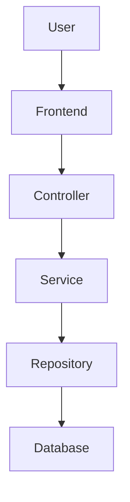

# 🎙️ Voice-Driven Virtual Customer Success Manager (VCSM)

## 📖 Project Overview

Voice-Driven Virtual Customer Success Manager (VCSM) is a Spring Boot web application that serves as a **Voice-enabled Virtual Community Manager** for resident support and community engagement.

It enables users to:

- File complaints and track status.
- Interact using Voice Assistant.
- View visuals of stats related to complaints and engagement.
- View and register for events.

---

## 📑 Table of Contents

- [🚀 Features](#-features)
- [🎤 Example Voice Commands](#-example-voice-commands)
- [🛠️ Tech Stack](#%EF%B8%8F-tech-stack)
- [🏗️ Architecture](#%EF%B8%8F-architecture)
- [▶️ Installation and Setup](#%EF%B8%8F-installation-and-setup)
- [🔑 Omnidim.io Voice AI Setup](#-omnidimio-voice-ai-setup)
- [📡 API](#-api)
- [📘 API Request & Response Examples](#-api-request--response-examples)
- [📁 Project Structure](#-project-structure)
- [📸 Screenshots](#-screenshots)
- [🚀 Deployment](#-deployment)
- [🛠️ Troubleshooting](#%EF%B8%8F-troubleshooting)
- [🤝 Contributing](#-contributing)
- [🚀 Future Enhancements](#-future-enhancements)

---

## 🚀 Features

- **🎤 Voice Assistant** — Web Speech API + Omnidim.io integration for natural language commands
- **📋 Complaint Management** — File, track, and resolve resident complaints with status updates
- **📅 Event Management** — Create, browse, and register for community events
- **📊 Analytics Dashboard** — Visual charts for complaint stats and community engagement
- **🤖 Intent Detection** — Smart routing of voice commands to appropriate modules

---

## 🎤 Example Voice Commands

The Voice Assistant supports natural language commands and automatically routes them to the appropriate module using intent detection.

### 📋 Complaint Management

| Example Command                                | Action                              |
| ---------------------------------------------- | ----------------------------------- |
| "File a complaint about excessive noise"       | Creates a noise complaint           |
| "There is a maintenance issue in my apartment" | Creates a maintenance complaint     |
| "Report a broken facility"                     | Creates a maintenance complaint     |
| "I have a parking complaint"                   | Creates a parking-related complaint |
| "I want to report a security issue"            | Creates a security complaint        |

### 🔍 Complaint Status

| Example Command             | Action                          |
| --------------------------- | ------------------------------- |
| "Check my complaint status" | Displays complaint statistics   |
| "Show my complaint status"  | Retrieves complaint information |
| "Check complaint progress"  | Shows current complaint status  |

### 📅 Event Queries

| Example Command                           | Action                             |
| ----------------------------------------- | ---------------------------------- |
| "Show upcoming events"                    | Displays upcoming community events |
| "Are there any sports events?"            | Retrieves sports-related events    |
| "What cultural activities are available?" | Lists cultural events              |
| "Show community activities"               | Displays available activities      |

### 📊 Analytics

| Example Command                 | Action                       |
| ------------------------------- | ---------------------------- |
| "Show analytics"                | Displays community analytics |
| "How many complaints are open?" | Shows complaint statistics   |
| "Show complaint summary"        | Displays complaint summary   |
| "Show total complaints"         | Retrieves complaint counts   |

### 🗣️ Voice Profile & Biometrics

| Example Command                                   | Action                                    |
| ------------------------------------------------- | ----------------------------------------- |
| "Enroll my voice"                                 | Registers voice print for future auth     |
| "Verify my identity"                              | Performs voice biometric verification     |
| "Change my language to Hindi"                     | Switches voice interface language         |
| "Switch to English"                               | Switches back to English                  |

### 👤 Account & Profile

| Example Command              | Action                        |
| ---------------------------- | ----------------------------- |
| "Show my profile"            | Opens user profile page       |
| "Update my apartment number" | Prompts to update apartment   |
| "Log out"                    | Logs out of the application   |

### 🆘 Help & Navigation

| Example Command            | Action                         |
| -------------------------- | ------------------------------ |
| "Help"                     | Shows available voice commands |
| "Go to dashboard"          | Navigates to dashboard         |
| "Show navigation"          | Displays navigation menu       |
| "What can I say?"          | Lists all supported commands   |

> The assistant uses keyword-based intent detection and may support additional natural language variations of these commands. Say "Help" at any time to see available commands.

---

## 🛠️ Tech Stack

| Layer    | Technology                         |
| -------- | ---------------------------------- |
| Backend  | Spring Boot 3.2, Spring Data JPA   |
| Frontend | Thymeleaf, Bootstrap 5, Chart.js   |
| Database | H2 (in-memory, dev)                |
| Voice AI | Omnidim.io API + Web Speech API    |
| Build    | Maven                             |

---

## 🏗️ Architecture




## ▶️ Installation and Setup

### Prerequisites

- Java 17 or later
- Maven 3.8 or later (optional when using the Maven Wrapper)

### Steps

```bash
# 1. Clone or unzip the project
cd voice-customer-success-manager

# 2. Run the application
./mvnw spring-boot:run

# 3. Open in browser
http://localhost:8080
```

### Windows (PowerShell)

If you are using Windows, open **PowerShell** in the project directory and run:

```powershell
# Run the application using the Maven Wrapper
.\mvnw.cmd spring-boot:run
```

If Maven is installed globally, you can also use:

```powershell
mvn spring-boot:run
```

After the application starts, open:

```
http://localhost:8080
```

### Verify Java Installation

Run the following command to verify that Java is installed correctly:

```powershell
java -version
```

The project requires **Java 17 or later**.

### Verify Maven Installation (Optional)

If you are not using the Maven Wrapper, verify Maven with:

```powershell
mvn -version
```

### Windows-specific Troubleshooting

#### Java is not recognized

If PowerShell displays:

```text
'java' is not recognized as an internal or external command
```

Ensure that:

- Java 17 or later is installed.
- The `JAVA_HOME` environment variable is configured.
- The Java `bin` directory is included in your system `PATH`.

#### mvnw.cmd cannot be found

Run the command from the project's root directory where the `mvnw.cmd` file is located.

#### Port 8080 is already in use

Stop the process using port **8080** or configure a different server port in `application.properties`.


### H2 Database Console (for dev/debugging)
```
http://localhost:8080/h2-console
JDBC URL: jdbc:h2:mem:vcsmdb
Username: sa
Password: (leave blank)
```

---

## 🔑 Omnidim.io Voice AI Setup

1. Sign up at [omnidim.io](https://omnidim.io)
2. Get your API key
3. Update `application.properties`:
```properties
omnidim.api.key=YOUR_ACTUAL_API_KEY
```

---

---

## Required Environment Variables

The application uses environment variables for all secrets and configuration. Copy these into your `.env` file or set them in your deployment environment:

| Variable | Required | Default | Description |
|----------|----------|---------|-------------|
| `JWT_SECRET` | Yes | — | JWT signing key (min 32 chars) |
| `OMNIDIM_API_KEY` | Yes | — | Omnidim.io Voice AI API key |
| `HMAC_SECRET` | Yes | — | HMAC request signing key |
| `ADMIN_USERNAME` | No | `admin` | Default admin seed username |
| `ADMIN_PASSWORD` | No | — | Default admin seed password |
| `JWT_EXPIRATION` | No | `86400000` | Access token expiry (ms) |
| `JWT_REFRESH_EXPIRATION` | No | `604800000` | Refresh token expiry (ms) |
| `TWILIO_AUTH_TOKEN` | No | — | Twilio account auth token |
| `PORT` | No | `8080` | Server port |

---

## 📡 API 

### Complaints
| Method | Endpoint | Description |
|--------|----------|-------------|
| POST | /api/complaints | File new complaint |
| GET | /api/complaints | Get all complaints |
| GET | /api/complaints/{id} | Get by ID |
| GET | /api/complaints/status/{status} | Filter by status |
| PUT | /api/complaints/{id}/status | Update status |
| GET | /api/complaints/stats | Complaint statistics |

### Events
| Method | Endpoint | Description |
|--------|----------|-------------|
| POST | /api/events | Create event |
| GET | /api/events | Get all events |
| GET | /api/events/upcoming | Upcoming events |
| GET | /api/events/recommend?keyword=sports | Recommendations |
| POST | /api/events/{id}/register | Register for event |

### Voice
| Method | Endpoint | Description |
|--------|----------|-------------|
| POST | /api/voice/command | Process voice command |
| GET | /api/voice/history | Recent commands |

### Analytics
| Method | Endpoint | Description |
|--------|----------|-------------|
| GET | /api/analytics | Full analytics data |

---

## 📘 API Request & Response Examples

### 📋 Create Complaint

**Request**

```http
POST /api/complaints
Content-Type: application/json
```

```json
{
  "residentName": "John Doe",
  "description": "Water leakage in Block A.",
  "category": "MAINTENANCE",
  "apartmentNumber": "A-204",
  "contactEmail": "john@example.com"
}
```

**Example Response**

```json
{
  "id": 1,
  "residentName": "John Doe",
  "description": "Water leakage in Block A.",
  "status": "OPEN",
  "category": "MAINTENANCE",
  "apartmentNumber": "A-204",
  "contactEmail": "john@example.com",
  "priority": "MEDIUM",
  "autoAssigned": true
}
```

---

### 📅 Create Event

**Request**

```http
POST /api/events
Content-Type: application/json
```

```json
{
  "name": "Community Clean-up Drive",
  "description": "Join the neighborhood clean-up event.",
  "category": "SOCIAL",
  "location": "Community Park",
  "eventDate": "2026-07-10T09:00:00",
  "maxCapacity": 100,
  "organizer": "Community Association"
}
```

**Example Response**

```json
{
  "id": 5,
  "name": "Community Clean-up Drive",
  "category": "SOCIAL",
  "location": "Community Park",
  "eventDate": "2026-07-10T09:00:00",
  "registrations": 0,
  "active": true
}
```

---

### 🎤 Process Voice Command

**Request**

```http
POST /api/voice/command
Content-Type: application/json
```

```json
{
  "transcript": "Show upcoming events"
}
```

**Example Response**

```json
{
  "originalText": "Show upcoming events",
  "detectedLanguage": "en",
  "response": "Here are the upcoming events.",
  "success": true
}
```

---

### 📊 Complaint Statistics

**Request**

```http
GET /api/complaints/stats
```

**Example Response**

```json
{
  "OPEN": 12,
  "IN_PROGRESS": 5,
  "RESOLVED": 18,
  "CLOSED": 4
}
```

## 📁 Project Structure

```
src/main/java/com/vcsm/
├── VcsmApplication.java       # Entry point
├── controller/                # REST + Web controllers
├── model/                     # JPA entities
├── repository/                # Spring Data repos
├── service/                   # Business logic
└── config/                    # Data seeder
```

---
## 📸 Screenshots

Screenshots will be added once a stable or deployed version of the application is available.

---

## 🚀 Deployment

- **Live Demo:** Not available currently.

The application is currently not deployed. It can be run locally using the setup instructions above.

---

## 🛠️ Troubleshooting

- Ensure Java 17 or later is installed.
- Run `mvn clean install` if the build fails.
- Access the H2 console at `http://localhost:8080/h2-console`.

---

## 🤝 Contributing

1. Fork repo
2. Create branch
3. Commit changes
4. Push branch
5. Open PR

### 👥 Contributors

Thanks to all contributors ❤️

[](https://github.com/ArpitaVerma16/Voice-Driven-Virtual-Customer-Success-Manager/graphs/contributors)

---

## 🚀 Future Enhancements
- Deploy application on cloud (Render/AWS/Railway)
- Add user authentication
- Add role-based access 
- Improve mobile responsiveness of UI
- Add real-time notifications for complaint updates
- Enhance voice assistant accuracy and intent detection
- Improve analytics dashboard with advanced charts and filters

