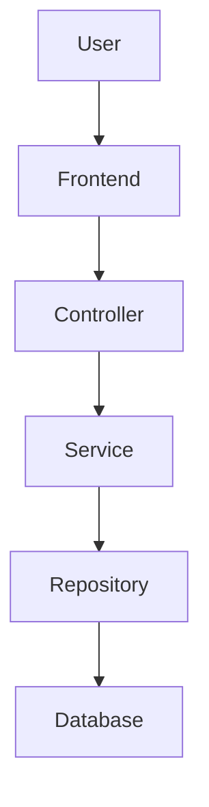

# 🎙️ Voice-Driven Virtual Customer Success Manager (VCSM)

## Project Overview 

Voice-Driven Virtual Customer Success Manager (VCSM) is a Spring Boot web application that serves as a **Voice-enabled Virtual Community Manager** for resident support and community engagement.

It enables users to:
- File complaints and track status.
- Interact using Voice Assistant.
- View visuals of stats related to complaints and engagement.
- View and register for events.

---

## 🚀 Features

- **🎤 Voice Assistant** — Web Speech API + Omnidim.io integration for natural language commands
- **📋 Complaint Management** — File, track, and resolve resident complaints with status updates
- **📅 Event Management** — Create, browse, and register for community events
- **📊 Analytics Dashboard** — Visual charts for complaint stats and community engagement
- **🤖 Intent Detection** — Smart routing of voice commands to appropriate modules

---

## 🛠️ Tech Stack

| Layer | Technology |
|-------|-----------|
| Backend | Spring Boot 3.2, Spring Data JPA |
| Frontend | Thymeleaf, Bootstrap 5, Chart.js |
| Database | H2 (in-memory, dev) |
| Voice AI | Omnidim.io API + Web Speech API |
| Build | Maven |

---

## 🏗️ Architecture




## ▶️ Installation and Setup

### Prerequisites
- Java 17+
- Maven 3.8+

### Steps

```bash
# 1. Clone or unzip the project
cd voice-customer-success-manager

# 2. Run the application
./mvnw spring-boot:run

# 3. Open in browser
http://localhost:8080
```

### H2 Database Console (for dev/debugging)
```
http://localhost:8080/h2-console
JDBC URL: jdbc:h2:mem:vcsmdb
Username: sa
Password: (leave blank)
```

---

## 🔑 Omnidim.io Voice AI Setup

1. Sign up at [omnidim.io](https://omnidim.io)
2. Get your API key
3. Update `application.properties`:
```properties
omnidim.api.key=YOUR_ACTUAL_API_KEY
```

---

## 📡  API 

### Complaints
| Method | Endpoint | Description |
|--------|----------|-------------|
| POST | /api/complaints | File new complaint |
| GET | /api/complaints | Get all complaints |
| GET | /api/complaints/{id} | Get by ID |
| GET | /api/complaints/status/{status} | Filter by status |
| PUT | /api/complaints/{id}/status | Update status |
| GET | /api/complaints/stats | Complaint statistics |

### Events
| Method | Endpoint | Description |
|--------|----------|-------------|
| POST | /api/events | Create event |
| GET | /api/events | Get all events |
| GET | /api/events/upcoming | Upcoming events |
| GET | /api/events/recommend?keyword=sports | Recommendations |
| POST | /api/events/{id}/register | Register for event |

### Voice
| Method | Endpoint | Description |
|--------|----------|-------------|
| POST | /api/voice/command | Process voice command |
| GET | /api/voice/history | Recent commands |

### Analytics
| Method | Endpoint | Description |
|--------|----------|-------------|
| GET | /api/analytics | Full analytics data |

---

## 📁 Project Structure

```
src/main/java/com/vcsm/
├── VcsmApplication.java       # Entry point
├── controller/                # REST + Web controllers
├── model/                     # JPA entities
├── repository/                # Spring Data repos
├── service/                   # Business logic
└── config/                    # Data seeder
```

---
## 📸 Screenshots

Screenshots will be added once a stable or deployed version of the application is available.

---

## 🚀 Deployment
- Live Demo: Not available currently
The application is currently not deployed. It can be run locally using the setup instructions below.

---

## 🛠️ Troubleshooting

- Ensure Java 17+ is installed
- Run `mvn clean install` if build fails
- H2 console: http://localhost:8080/h2-console

---

## 🤝 Contributing

1. Fork repo
2. Create branch
3. Commit changes
4. Push branch
5. Open PR

---

## 🚀 Future Enhancements
- Deploy application on cloud (Render/AWS/Railway)
- Add user authentication
- Add role-based access 
- Improve mobile responsiveness of UI
- Add real-time notifications for complaint updates
- Enhance voice assistant accuracy and intent detection
- Improve analytics dashboard with advanced charts and filters

